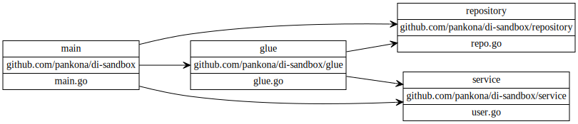

# DI-sandbox

DI について考えるためのリポジトリ written in Go

## モジュール間の依存関係

本リポジトリにおけるモジュール (≒package) は以下。

## ポイント

* service と repository が (package 参照レベルで) 依存しない構造を目指したもの
* 実際には service は repository を使っているが、直接使わずに、第三の glue package を介して用いる。
これにより、repository の変更が service に波及しない作りになることを期待。
* 実際に service、もしくは repository に変更が発生した場合、glue package で吸収する想定。
  * interface レベルでの変更も、実装レベルでの変更も glue package で吸収する。

## 補足など

* Go で DI と言った時によくあるパターンと言えば、service の初期化時などに repository の interface をセットするやり方かと思われる。
  * service に struct ではなく interface を渡すことにより、実装の挿げ替えが可能になる。
  * ただ、repository の interface が repository package に含まれている場合、
  package 参照としては service は repository に依存する形になってしまう。
  * つまり、repository の変更都合によっては、service 側も変更を余儀なくされてしまい、
  いわゆる Single Responsibility Principal に反してしまうように思う。

* 上記の package 参照レベルでの依存が発生してしまうのは、
repository の interface が repository package に含まれている場合である。
  * であれば、repository の interface を repository 外に書くようにすれば解決しそう。
  * 本リポジトリのソースコードでは、第三の package (glue package) に置く形をとった。
  * service package に置いてもいいかもしれないが、
  interface の実装を考えるときに repository に依存が発生してしまいそうなのでいったん考えるのをやめた。

## LICENSE

MIT

## Author

Yosuke Akatsuka (a.k.a pankona)
yosuke.akatsuka@gmail.com
